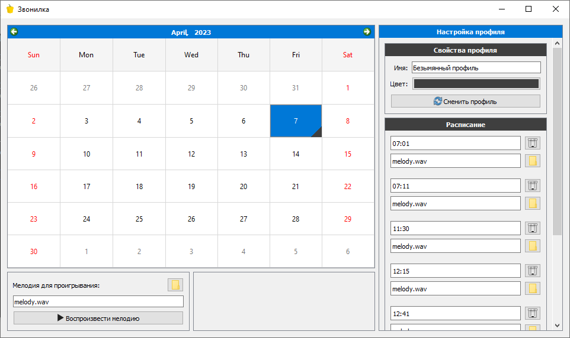

# Звонилка

**Звонилка** - приложение для проигрывание мелодий по расписанию. Оно в первую очередь нацелено на образовательные учереждения, использующие систему электронных музыкальных звонков.

## Установка и запуск

- Для запуска прогроаммы вам потьребуется Python и pip. Программа не постваляется в собранном виде, стремясь дать пользователю возможность легко изменять ее под свои нужды.
- Запустите файл `run.bat`, он установит необходимый для работы программы пакет `PyQt5` и запустит программу.
- Запуск программы в дальнейшем может осуществляться так же при помощи файла `run.bat`.

> **Note**
> Звонилка остается на пятой версии PyQt, стремясь сохранить как можно более низкие системные требования. Фреймворк Qt версии 6 работает лишь на поздних сборках Windows 10 и версиях Windows выпущенных позднее, в то время как большое количество образовательных учереждений используют Windows 7.

